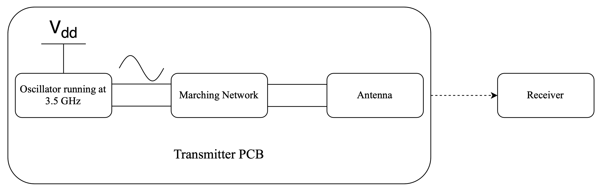
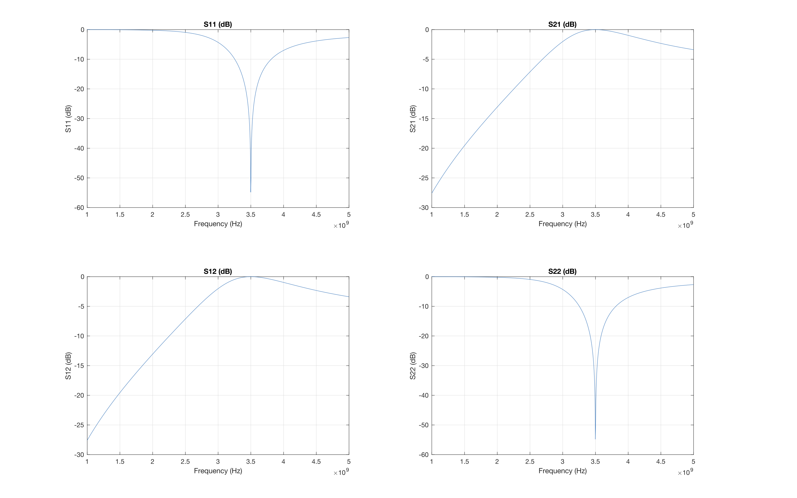
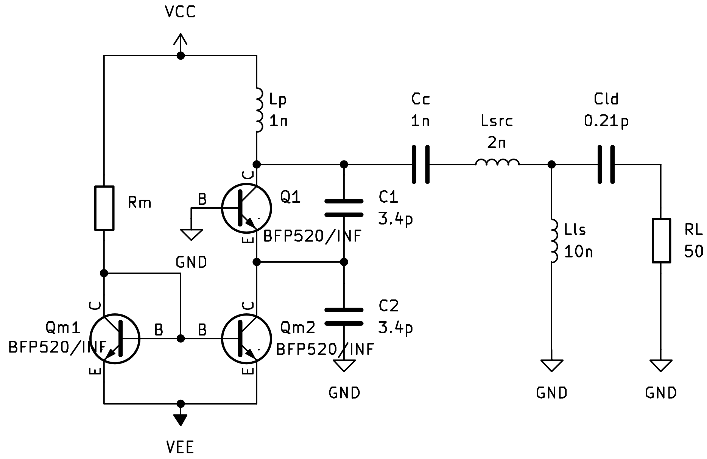
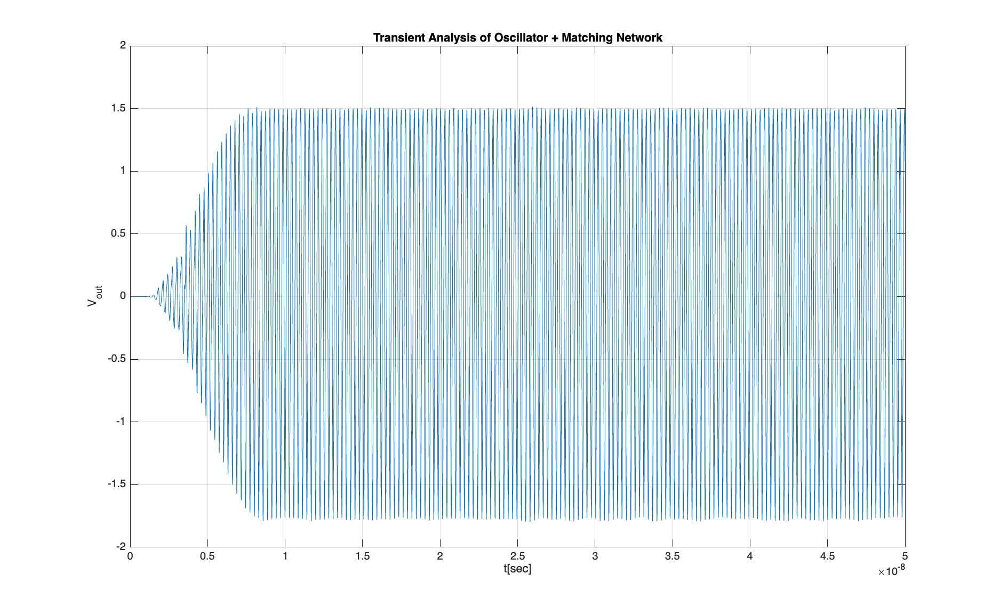
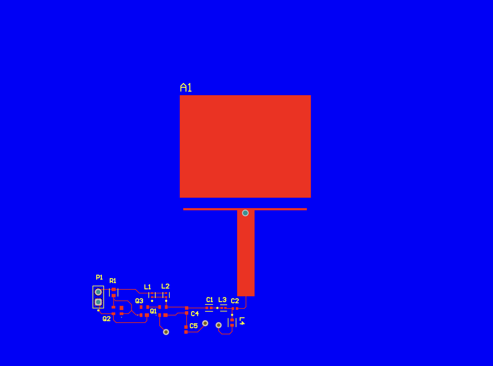

# RF Oscillator and Wireless Transmitter

This project focuses on designing and implementing a high-frequency oscillator tuned to 3.5 GHz for enhancing transmitter antenna performance. It integrates RF engineering, microwave engineering, and analog circuits, aiming to improve communication systems and impact applications like 5G, satellite communications, and MRI. The process involves modeling, component selection, simulation, and rigorous testing to ensure optimal functionality and integration with antenna systems.



## Setup

1. Clone GitHub

    ```
    https://github.com/Mazz84002/RF-Oscillator-and-Wireless-Transmitter
    ```

2. Setup Python environment
    
    Change to the home directory of the GitHub project and execute
    
    ```
    conda create -n f_proj_env
    conda activate f_proj_env
    pip install -r requirements.txt
    pip list
    ```
    All the Python files and Jupyter Notebooks can now be executed

3. Setup MATLAB
    Toolboxes used
    - Signal Processing Toolbox
    - Control Toolbox

4.  Additional Software Required to run files
    - LTSpice
    - PSpice
    - Altium
    - CST
    - Cadence Virtuoso

## Design
All plots and associated design-files can be found in the folders named accordingly.
### Matching
Calculations for the matching networks were performed using Python. The objective was to design a T-topology matching network to match the antenna impedance to a high impedance for high voltage swing.



### Oscillator
We used the formulas from the theoretical section of the report to set the operating point and
startup conditions of the oscillator. These calculations were essential for guiding our design
and ensuring that everything would work as intended.





To get the oscillator to hit the exact frequency we needed, a series of sweeps were run
using Virtuoso Spectre, allowing us to tweak and fine-tune the circuit components until to
achieve the precise frequency.

### Antenna
We first used Python to measure the antenna dimensions, writing scripts to analyze the design parameters and determine the precise measurements needed


### PCB



## License

The repo is distributed under MIT License
